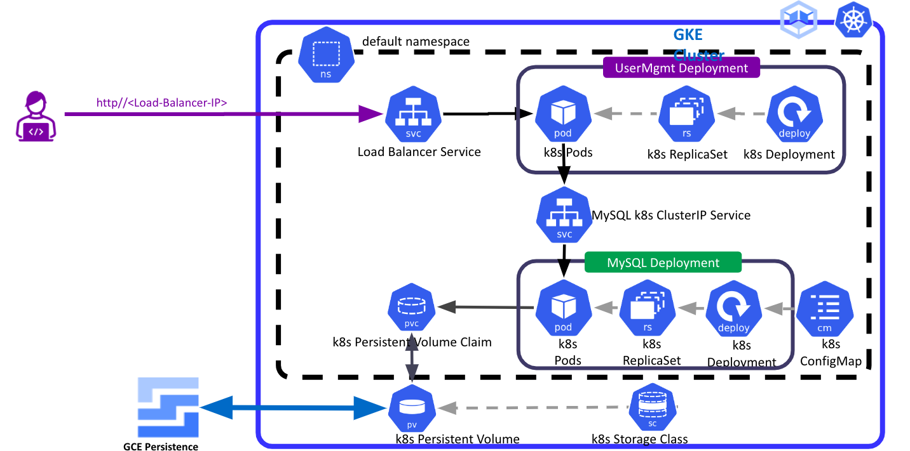
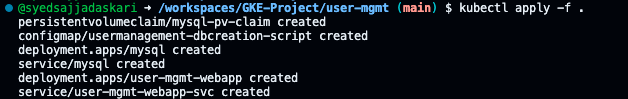

# Deployment of User Managment System using GKE

Deploy a robust User Management System on Google Kubernetes Engine (GKE) utilizing Load Balancer, Persistent Volume Claims (PVC), and Storage Class. Seamlessly integrate ConfigMaps and Secrets for enhanced security and configurability. Empower your infrastructure with scalable and resilient architecture.

## Step-00: Pre-requisites
1. Verify if GKE Cluster is created
2. Verify if kubeconfig for kubectl is configured in your local terminal

```
# Configure kubeconfig for kubectl
gcloud container clusters get-credentials <CLUSTER-NAME> --region <REGION> --project <PROJECT>

# Replace Values CLUSTER-NAME, ZONE, PROJECT
gcloud container clusters get-credentials standard-cluster-private-1 --region us-central1
```


## Architecture of K8s


In the image, you can see a sample deployment of a UserMgmt application. The UserMgmt deployment uses a MySQL database. The MySQL deployment uses a persistent volume claim (PVC) to request storage from the Kubernetes cluster. The cluster administrator has created a storage class to define the type of storage to be provisioned for the PVC. A load balancer is configured to distribute traffic to the UserMgmt pods.

## Step-01: Kubernetes YAML Manifests
``` 
cd user-mgmt
ls
```

01-persistent-volume-claim.yaml
02-UserManagement-ConfigMap.yaml
03-mysql-deployment.yaml
04-mysql-clusterip-service.yaml
05-UserMgmtWebApp-Deployment.yaml
06-UserMgmtWebApp-LoadBalancer-Service.yaml
 
 
## step-02 Deploye user-mgmt


 ```
 # Deploy Kubernetes Manifests
kubectl apply -f .

# List Storage Classes
kubectl get sc

# List PVC
kubectl get pvc

# List PV
kubectl get pv

# List ConfigMaps
kubectl get configmap

# List Deployments
kubectl get deploy

# List Pods
kubectl get pods

# List Services
kubectl get svc

# Verify Pod Logs
kubectl get pods
kubectl logs -f <USERMGMT-POD-NAME>
kubectl logs -f usermgmt-webapp-6ff7d7d849-7lrg5
 ```

 ## step-03: Verify Persistent Disks
* Go to Compute Engine -> Storage -> Disks
* Search for 4GB Persistent Disk
* **Observation:** You should see the disk type as SSD persistent disk

## step-04: Access Application
```
# List Services
kubectl get svc

# Access Application
http://<ExternalIP-from-get-service-output>
Username: admin101
Password: password101
```

## step-5: Clean-Up
```
# Delete kube-manifests
kubectl delete -f user-mgmt/
```
